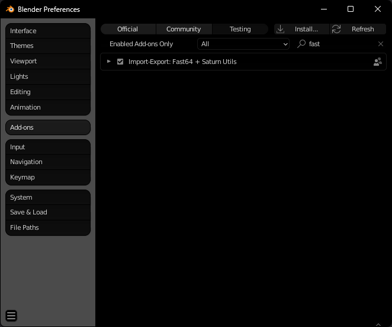
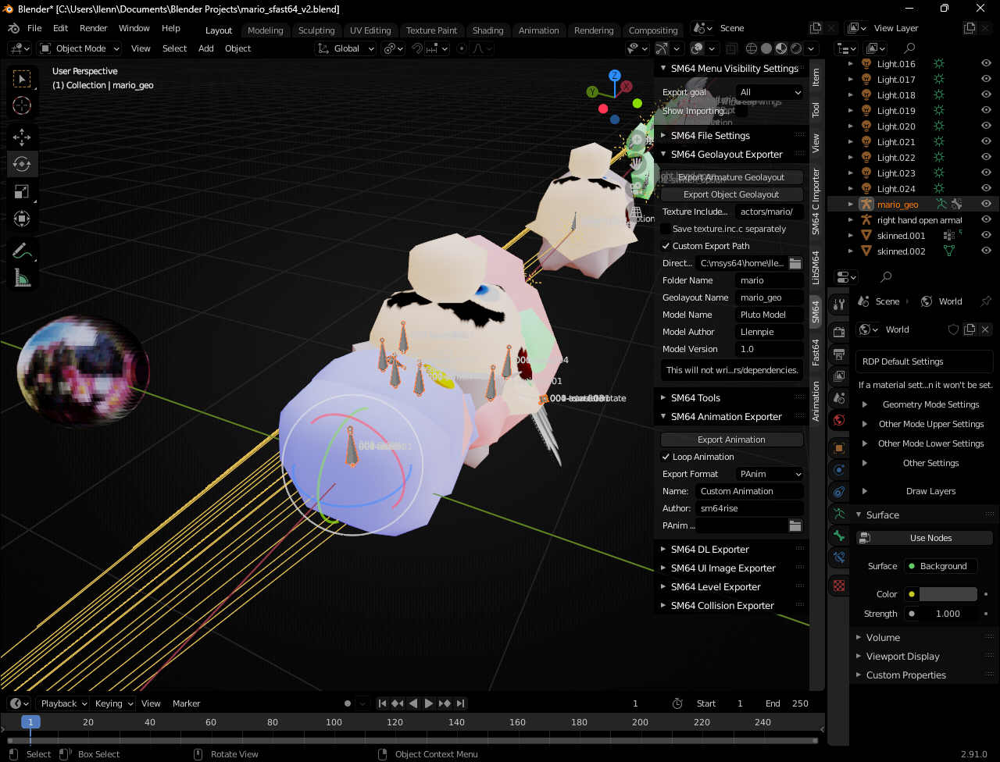

These guides demonstrate the fundamentals of creating a Pluto-compatible model, and adding features for machinima such as **color codes** and **expressions**.

{: .note }
Prior knowledge of both Blender and Fast64 is highly recommended - watch a [YouTube tutorial](https://www.youtube.com/watch?v=D-ZQsYedBt8) to familiarize yourself with the process.

## Setting up SFast64
---

While not required, Pluto utilizes a custom fork of Fast64 for several features, such as bone translation/scale and unique geo commands.

- [PFast64 (GitHub Repo)](https://github.com/Llennpie/PFast64)
- Install the plugin from Github with **Code -> Download ZIP** 
- Add to plugin to Blender with **Edit -> Preferences... -> Add-ons -> Install...**

From there, you should be able to open the [example blend](https://github.com/Llennpie/SFast64/raw/refs/heads/pluto/mario_v4.blend) and start creating.

If the **panel on the right side** contains tabs for **SM64** and **Fast64**, setup is complete.

